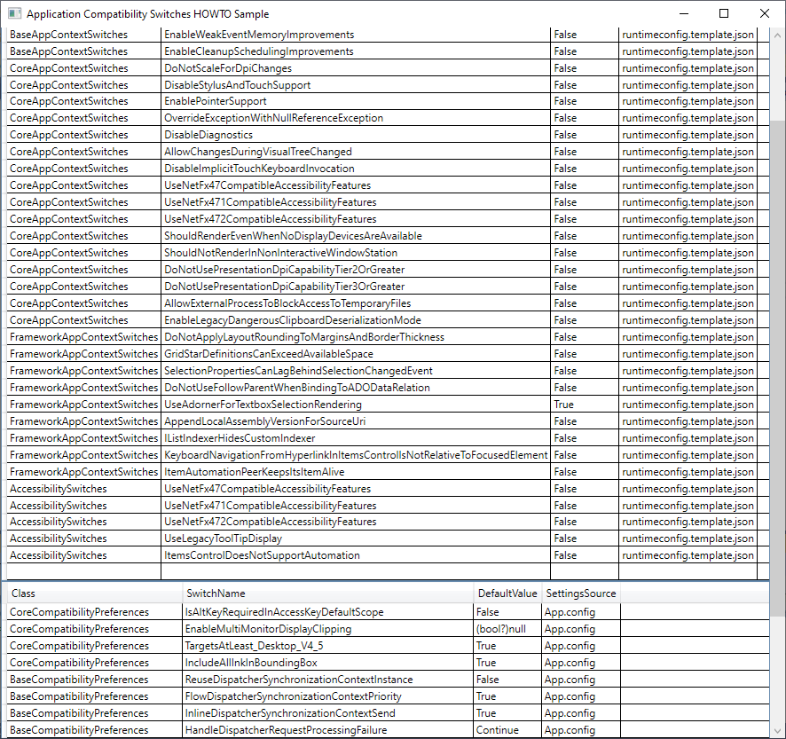

## .NET Core 3.0 - Applicaiton Compatibility Quirks HOWTO 

This sample shows how Application Compatibility quirks are enabled in a WPF application. 

There are two quriking infrastructures used in WPF 

- AppContext
- CompatibilityPreferencs

### AppContext 

`AppContext` based quirks are set in `runtimeconfig.template.json`. Alternatively, they can also be enabled in code. the documentation about [`System.AppContext`](https://docs.microsoft.com/en-us/dotnet/api/system.appcontext?view=netcore-3.0) provides a detailed overview of programmatic access to these quirking flags. 

These flags are no longer set in `App.Config` as was the practice in .NET Framework applications - instead, they should be set in `runtimeconfig.template.json`. This project shows an example [`runtimeconfig.template.json`](runtimeconfig.template.json) containing all available `AppContext` based quirks. The default values for each flag, and related documentation is also provided in this file. 

### `CompatibilityPreferences`

WPF also uses an `App.config` based quirking system that are implemented by the following types: 

- `System.Windows.CoreCompatibilityPreferences`
- `System.Windows.BaseCompatibilityPreferences`
- `System.Windows.FrameworkComatibilityPreferences`

A sample [`App.Config`](App.config) is also provided, which lists all supported flags along with their respective default values and documentation. 

Running this app will list all the supported flags, and show the respective *default* flag-values. 

