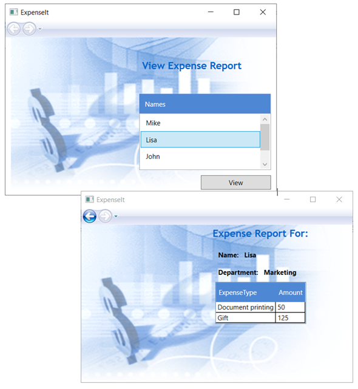

# First WPF app sample

This sample provides the C# code files for a starter WPF app, as described in [Walkthrough: My first WPF desktop application](https://docs.microsoft.com/dotnet/framework/wpf/getting-started/walkthrough-my-first-wpf-desktop-application).

For more information, see the [C# and Visual Basic sample overview](../README.md).

## Build the sample

The easiest way to use these samples without using Git is to download the zip file containing the current version (using the link below or by clicking the "Download ZIP" button on the repo page). You can then unzip the entire archive and use the samples in [Visual Studio](https://www.visualstudio.com/wpf-vs).

### Deploying the sample

- Select **Build** > **Deploy Solution**. 

### Deploying and running the sample

- To debug the sample and then run it, press **F5** or select **Debug** > **Start Debugging**. To run the sample without debugging, press **Ctrl** + **F5** or select **Debug** > **Start Without Debugging**. 

### Preview the layout

The completed walkthrough's UI will resemble the following.

