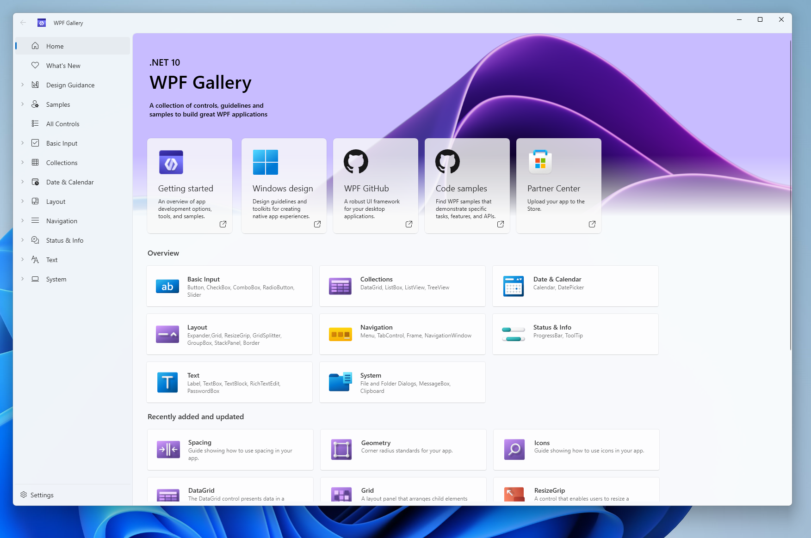
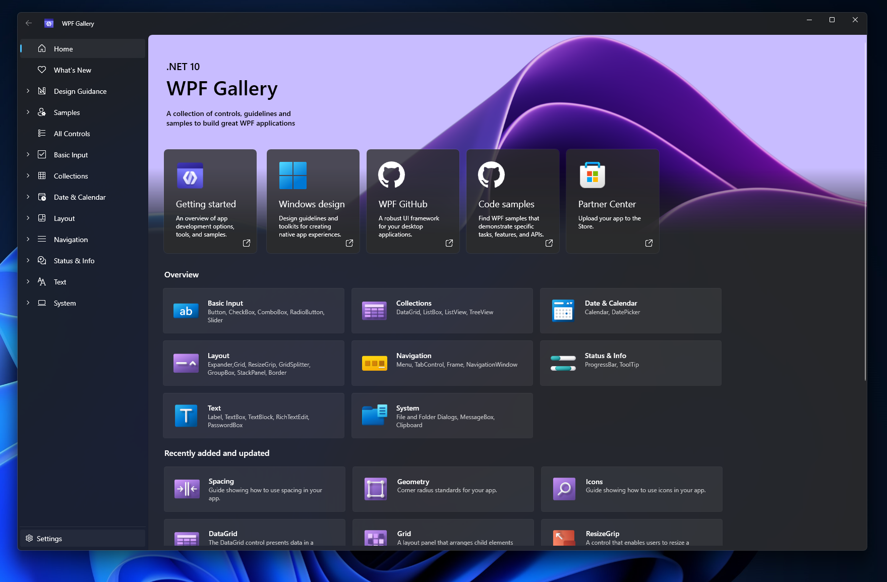

# WPF Gallery

This application showcases the new Fluent theme styles being introduced in WPF in .NET 9 Preview 4.



The WPF Gallery shows how to specify XAML controls in markup as each control page shows the markup used to create each example. It will also show all of the possible layout options for your app. 

WPF Gallery app also contains the design guidance for using colors, typography and icons to develop exceptional applications. It also includes a sample page to showcase how to use different controls to create a user dashboard in a WPF application. 

The new themes adapt to system color and accent adjustments too. As depicted below, this is how the application appears when the system's dark mode is activated:




## Further Information

Developers need to do the following changes in order to use this application:
1. Download the latest .NET 9 or above available [here](https://dotnet.microsoft.com/en-us/download/dotnet/9.0).
2. (Optional) Update `sdk`'s `version` to latest 9 preview, or the one available in local system, in `global.json` present in the repository root.

Additionally, if developer wants to use the locally built WPF binaries, the following steps in addition to the above 2 steps needs to be done:
- Clone the WPF repository, available [here](https://github.com/dotnet/wpf/)
- Build the `main` branch in the repository by running the command: `.\build.cmd -plat x64`
- If the WPF build fails, install the components mentioned in [wpf.vsconfig](https://github.com/dotnet/wpf/blob/main/Documentation/wpf.vsconfig).
- Update the `WpfRepoRoot` with it's path in `WPFGallery.csproj` file.

If the developer does not want to have the `Mica` backdrop effect in their applciation, they can do so by disabling it via the `RuntimeHostConfigurationOption`. This can be done by adding the following code to the `WPFGallery.csproj`.
```xml
<ItemGroup>
    <RuntimeHostConfigurationOption Include="Switch.System.Windows.Appearance.DisableFluentThemeWindowBackdrop" Value="true" />
</ItemGroup>
```